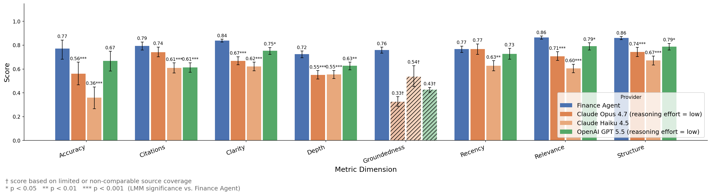

# Finance Agent Benchmark

A benchmark for evaluating financial agents on three types of tasks: (1) financial obligations research, (2) financial performance research, and (3) business brief generation. Agents have access to live data sources via the internet and an MCP server conntected to a Microsoft Dynamics for Finance backend. Answers are scored with an LLM judge, grouned in rubric assertions, and compared among providers (Finance Agent, Anthropic Claude CLI, and OpenAI Responses API).

→ **[Overview and motivation](docs/overview.md)** — what this measures and why.



## Quickstart

```bash
uv sync
cp env.example .env   # add OPENAI_API_KEY and ERP_MCP_TOKEN
uv run refresh_erp_token.py
uv run run_benchmark.py --provider claude -n 5
```

See **[Getting Started](docs/getting-started.md)** for the full walkthrough.

---

## Pipeline

| Stage | Script | Output |
|---|---|---|
| Inference | `scripts/inference/inference.py` | `results/answers_{model}_{inf_slug}.json` |
| Evaluation | `scripts/evaluation/evaluate.py` | `results/eval_results_{model}_{inf_slug}_{eval_slug}.json` |
| Analysis | `scripts/analysis/compare_runs.py` | `results/images/`, `results/compare_stats.json`, `results/provider_comparison.md` |

`data/dataset.yaml` is pre-built and included. All settings live in `config.yaml`. Run everything at once with `run_benchmark.py`.

---

## Dataset

The benchmark contains ~300 questions across three task types, each reflecting a distinct finance assistant capability.

### Financial Obligation queries (ERP QA)

Questions about a company's internal accounts payable and receivable (AP/AR) position: outstanding balances, aged debt, open invoices, vendor payment terms. The agent must query a live ERP system via MCP tools and return structured, grounded answers.

Examples:
> *"What is the outstanding receivables balance for Birch Company as of March 2, 2026?"*

> *"What is the total overdue AP balance in USMF?"*

> *"Does Fourth Coffee East have any cash discount terms active on current invoices?"*

> *"Which collection letter level is Sparrow Retail at? Have they paid us recently?"*

### Financial entity performance research

Questions about publicly traded companies' financial performance: earnings, ratios, cash flows, ESG metrics. The agent must locate current figures from public sources (filings, financial data providers) and present them with appropriate context.

Examples:
> *"What was ExxonMobil's GAAP current assets for fiscal year ended December 31, 2024?"*

> *"For our credit evaluation of Caterpillar, what is their long-term debt-to-equity ratio (3-year average) as of September 2025?"*

> *"What was Walmart's inventory turnover ratio for FY2024?"*

> *"What was Tesla's GAAP operating margin for the September 2025 quarter?"*

### Business briefs

Requests for a structured company profile synthesising public financial data, business context, and — where available — internal ERP data. Evaluated against ground-truth briefs on coverage, accuracy, and structure.

Examples:
> *"Business Brief report of Apple Inc."*

> *"Company Overview report of AT&T Inc."*

> *"Corporate Profile report of Lockheed Martin Corp"*

---

## Documentation

| Doc | Contents |
|---|---|
| [Getting Started](docs/getting-started.md) | First run, output interpretation, troubleshooting |
| [Inference](docs/inference.md) | Configuration, resume, output schema |
| [Evaluation](docs/evaluation.md) | Scoring methodology, judge routing, rubric |
| [Analysis](docs/analysis.md) | Provider comparison, plots, run tracking queries |
| [Claude setup](docs/anthropic.md) | Claude-specific inference setup |
| [OpenAI setup](docs/openai.md) | OpenAI Responses API, Deep Research, ChatGPT proxy |
| [ERP QA setup](docs/erp_qa_setup.md) | Backend options: Dynamics 365 or local SQLite mock server |

---

## Reproducing results

The Finance QA and Business Brief plugins only need web search — no special infrastructure. The **ERP QA plugin** requires a backend with the benchmark's synthetic AP/AR data exposed over MCP.

Start here: **[ERP QA Setup](docs/erp_qa_setup.md)**

Two options are available:

- **Option A — Dynamics 365 Finance** (full fidelity, results directly comparable to published scores): import the synthetic data and connect via the official ERP MCP server. Guides: [Importing Synthetic Data](docs/importing_synthetic_data_into_dynamics_365_finance.md) → [Setting Up the ERP MCP Server](docs/setting_up_mcp_for_erp_qa.md).
- **Option B — Local SQLite mock** (no Dynamics licence required): load the CSV data into a local SQLite database and serve it via `mcp-server-sqlite`. Guide: [Setting Up a Local Mock MCP Server](docs/setting_up_mock_mcp_server.md).

Once connected, set `shared.mcp_server_label` in `config.yaml` to your MCP server entry and run normally. Option A also requires a bearer token (`uv run refresh_erp_token.py`); Option B does not.
