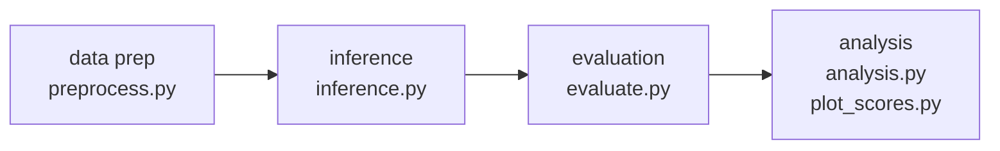

# Architecture

Reference overview of the Finance Copilot Benchmark pipeline.

---

## Pipeline stages



**Data prep** (`scripts/data_prep/preprocess.py`) reads the dataset triplets declared in `config.yaml` (`data_prep.output`, `plugin`, `input_yaml`, `tsv`, `lmc_rubric`) and writes the combined `data/dataset.yaml`. Each entry carries a `plugin` field, per-query `tags`, and rubric assertions used downstream by the judge.

**Inference** (`scripts/inference/inference.py --provider claude|openai`) loads `data/dataset.yaml`, dispatches each question through the appropriate provider module (`_claude.py` or `_openai.py`) via MCP-connected tools, and writes `results/answers_{model}_{inf_slug}.json` in the metadata-envelope format. Supports resume/retry, `--limit`, `--no-shuffle`, and `--no-retry-failed`. Sydney responses are ingested separately via `scripts/data_prep/prepare_sydney_answers.py`.

**Evaluation** (`scripts/evaluation/evaluate.py`) reads an `answers_*.json` file (auto-discovers the latest if `--answers` is omitted) alongside `data/dataset.yaml`, calls an OpenAI judge via DSPy with per-tag plugin-aware routing, and writes `results/eval_results_{answers_stem}_{eval_slug}.json`. Sources for groundedness are embedded in the inference output; no live fetching occurs at eval time.

**Analysis** (`scripts/analysis/analysis.py`, `plot_scores.py`, and friends) reads one or more `eval_results_*.json` files, computes N-way comparisons, and produces score bar charts (`scores_overall.png`, `scores_by_plugin.png`, `scores_by_segment.png`) plus optional markdown reports. Run tracking is persisted to `results/runs.db`.

---

## Configuration

All settings live in **`config.yaml`** at the repo root.

| Section | Contents |
|---|---|
| `shared` | Output directory, worker count, MCP config file path, active MCP server label, system instructions |
| `inference` | Runtime defaults for `shuffle` and `retry_failed` (both overridable via CLI flags) |
| `openai` | Model name, `max_tool_calls`, request timeout |
| `claude` | Model name, `max_turns` |
| `data_prep` | Combined dataset output path + list of dataset triplets (`plugin`, `input_yaml`, `tsv`, `lmc_rubric`) |
| `evaluation` | Judge deployment name, `reasoning_effort`, thread count |
| `sydney` | Output directory + list of offline sources (scrape zips and evaluation_results files) for aggregation |

To switch MCP environments, change only `shared.mcp_server_label` to match a different key in `.mcp.json`; all scripts resolve the URL from that label automatically.

---

## Result file formats

### Inference output

`results/answers_{model}_{inf_slug}.json`

```json
{
  "metadata": {
    "model": "claude-sonnet-4-5",
    "provider": "claude",
    "run_id": null,
    "run_timestamp": "2025-01-01T00:00:00Z",
    "config_hash": "a1b2c3d4e5f6",
    "config_snapshot": {}
  },
  "results": [
    {
      "question": "What is the aged balance for Contoso?",
      "segment": "Aged balances",
      "plugin": "erp_qa",
      "answer": "...",
      "answer_sequence_index": 3,
      "tool_calls": [
        {
          "sequence_index": 0,
          "tool": "erp_query",
          "input": {},
          "output": "...",
          "success": true
        }
      ],
      "tool_call_count": 1,
      "successful_tool_calls": 1,
      "inference_time_secs": 4.2,
      "error": null,
      "sources": { "https://example.com": "snippet text" }
    }
  ]
}
```

`config_hash` is the first 12 hex characters of the SHA-256 of `config_snapshot` serialised with sorted keys; used for deduplication in `runs.db`. Scripts reading answers handle both this envelope format and the legacy flat array.

### Evaluation output

`results/eval_results_{answers_stem}_{eval_slug}.json`

```json
{
  "metadata": {
    "answers_file": "results/answers_claude-sonnet-4-5_panda.json",
    "judge_model": "gpt-4.1",
    "eval_run_id": "falcon",
    "run_timestamp": "2025-01-01T01:00:00Z"
  },
  "summary": {
    "overall_score": 0.73,
    "scores_by_tag": { "accuracy": 0.81, "groundedness": 0.65 },
    "total_token_usage": { "prompt_tokens": 120000, "completion_tokens": 8000, "total_tokens": 128000 }
  },
  "results": [
    {
      "question": "What is the aged balance for Contoso?",
      "plugin": "erp_qa",
      "segment": "Aged balances",
      "scores": { "accuracy": 1.0, "groundedness": 0.5 },
      "reasoning": { "accuracy": "...", "groundedness": "..." },
      "token_usage": { "prompt_tokens": 800, "completion_tokens": 120, "total_tokens": 920 }
    }
  ]
}
```

Scores are on a continuous 0.0–1.0 partial credit scale. `token_usage` per result is the sum across all tag judge calls for that question. The judge uses `dspy.Predict` with explicit `reasoning` output fields.

Per-tag routing rules:
- `groundedness` (all plugins) — LLM judge; source content from inference output
- `finance_qa` / `citations` — raw markdown hyperlink count (no LLM)
- `erp_qa` / `citations` — standard LLM judge
- all others — standard LLM judge

---

## Run tracking (runs.db)

SQLite database at `results/runs.db`. One row per inference run; `eval_file` is `NULL` until evaluation completes. `inference_config_hash` enables deduplication — `run_benchmark.py` reuses an existing inference file when the hash matches (override with `--no-reuse`).

Schema (single `runs` table):

| Column | Type | Notes |
|---|---|---|
| `id` | INTEGER PK | Auto-increment |
| `inf_run_id` | TEXT | Coolname slug embedded in inference filename |
| `eval_run_id` | TEXT | Coolname slug embedded in eval filename; NULL until eval completes |
| `timestamp` | TEXT | ISO 8601 |
| `provider` | TEXT | `claude` or `openai` |
| `model` | TEXT | |
| `judge` | TEXT | |
| `inference_config_hash` | TEXT | First 12 hex of SHA-256 of config snapshot |
| `eval_config_hash` | TEXT | |
| `inference_file` | TEXT | Relative path from repo root |
| `eval_file` | TEXT | Relative path from repo root; NULL until eval completes |
| `shuffle` | INTEGER | Boolean |
| `retry_failed` | INTEGER | Boolean |
| `max_workers` | INTEGER | |
| `max_turns` | INTEGER | Claude-specific; NULL for OpenAI |
| `max_tool_calls` | INTEGER | OpenAI-specific; NULL for Claude |
| `timeout` | INTEGER | OpenAI-specific; NULL for Claude |

Useful commands:

```bash
uv run scripts/analysis/query_runs.py list
uv run scripts/analysis/query_runs.py list --provider claude --judge gpt-4.1
uv run scripts/analysis/query_runs.py export --output results.csv
uv run scripts/analysis/register_run.py   # retroactively register existing pairs
```

---

## Public export

The `/export-public` Claude Code skill (`.claude/skills/export-public/SKILL.md`) orchestrates publishing a sanitized snapshot to `github.com/microsoft/financebenchmark` as a single orphan commit (no history).

### How it works

1. **`scripts/export/build_public_snapshot.py`** — copies an allowlisted set of files to a staging directory (`/tmp/financebenchmark-public/`), scrubs internal config values, and verifies no internal strings remain.
2. **`scripts/export/llm_review.py`** — calls the Claude API to scan all `.md` and `.py` files in the staging directory for internal references; rewrites `.md` files automatically, warns on `.py` files.
3. **Git push** — inits an orphan branch in the staging directory and force-pushes to the public remote.

### Allowlist approach

Only an explicit list of paths is copied. Everything not on the list (raw source data, internal scripts, `.env`, `.mcp.json`, `.claude/`) is excluded. If a listed file doesn't exist (e.g. `data/dataset.yaml` before preprocessing), a warning is printed and the file is skipped.

### Config scrubbing

`build_public_snapshot.py` applies regex substitutions to `config.yaml` and `env.example` before verification:
- `config.yaml`: removes `mcp_config_file` and `mcp_server_label` lines, removes the entire `sydney:` block
- `env.example`: removes Azure-specific vars (`AZURE_OPENAI_*`, `AZ_*`); retains `OPENAI_API_KEY` and `ERP_MCP_TOKEN`

### Verification

After scrubbing, the script greps all files for known-internal patterns (tenant IDs, internal account names, internal resource identifiers). Any match causes a non-zero exit; the `/export-public` skill stops before pushing. The exact pattern list is defined in `INTERNAL_PATTERNS` in `build_public_snapshot.py`.

### CLI usage

```bash
# Dry-run (list files, no copy)
uv run scripts/export/build_public_snapshot.py --dry-run

# Build staging dir only (no push)
uv run scripts/export/build_public_snapshot.py

# Verify an existing staging dir
uv run scripts/export/build_public_snapshot.py --verify-only --output-dir /tmp/financebenchmark-public

# Full flow via skill
/export-public --dry-run
/export-public --version-tag 2026-05-01
```
